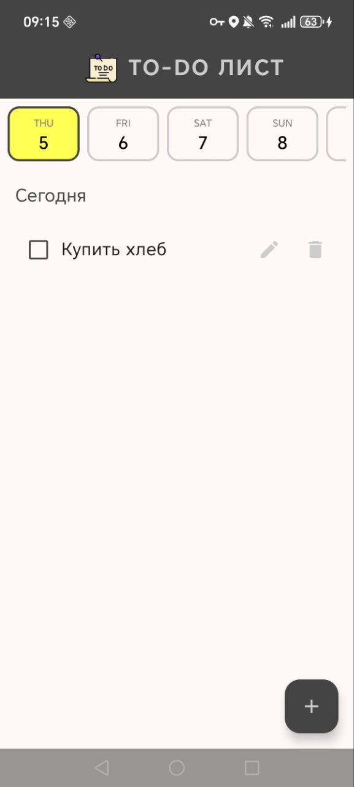
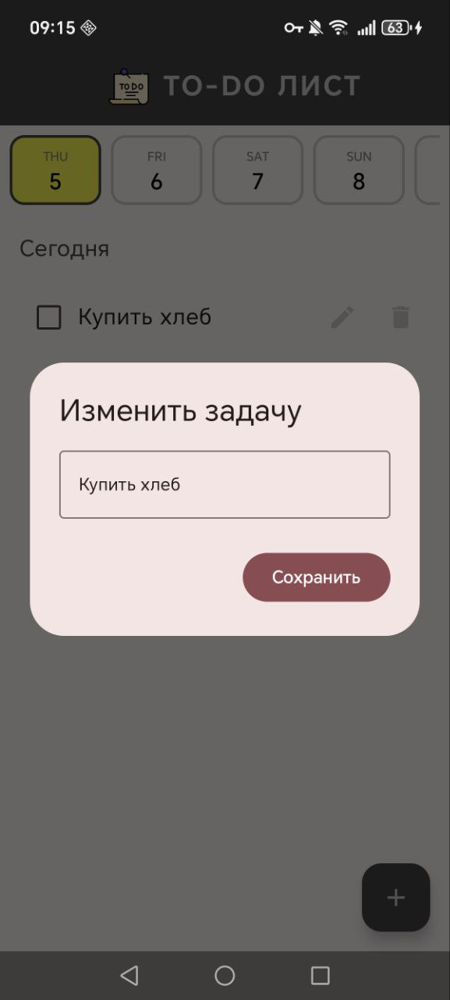
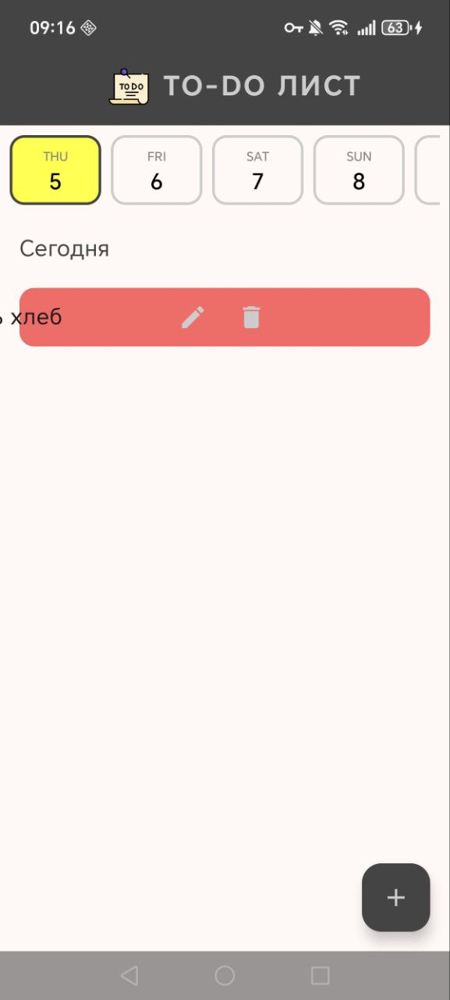

# To-Do List App (Jetpack Compose) 📝

Простое и функциональное Android-приложение для управления списком задач, созданное на **Jetpack Compose**. Позволяет планировать дела на неделю, редактировать их и сохранять данные локально.

## ✨ Основные функции

- **Еженедельный календарь**: Удобное переключение между днями текущей недели в верхней части экрана.
- **Управление задачами**: Добавление, редактирование и удаление задач (с подтверждением).
- **Интуитивные жесты**: Поддержка **Swipe-to-Delete** (удаление свайпом влево) для быстрой очистки списка.
- **Статус выполнения**: Возможность отмечать задачи как выполненные с визуальным зачеркиванием текста.
- **Локальное хранение**: Все данные сохраняются в `SharedPreferences` с использованием библиотеки **Gson**, поэтому задачи не пропадают после закрытия приложения.
- **Современный UI**: Использование компонентов Material 3 и адаптивной верстки.

## 🛠 Технологии

- **Kotlin** — основной язык разработки.
- **Jetpack Compose** — современный инструментарий для создания нативного UI.
- **Material 3** — актуальный дизайн-код от Google.
- **Gson** — сериализация данных для сохранения в JSON-формате.
- **Java Time API** — работа с датами и календарем.

## 📸 Интерфейс приложения

<p align="center">
  
  
  
</p>

## 🚀 Как запустить

1. Клонируйте репозиторий:
   ```bash
   git clone https://github.com/victo-zabel/ToDoListStudProject
   ```
2. Откройте проект в Android Studio (Ladybug или новее).
3. Дождитесь завершения синхронизации Gradle.
4. Запустите приложение на эмуляторе или реальном устройстве (Android 8.0+).

